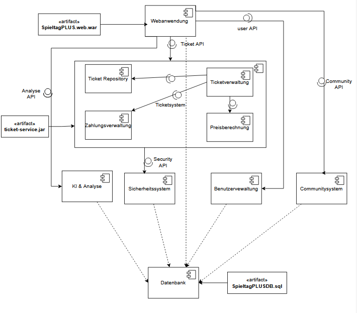
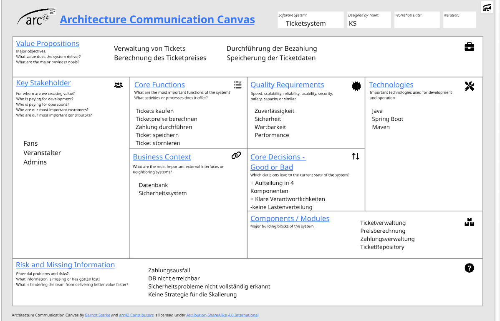

# Architektur

Für diese Aufgabe habe ich wieder mein Projekt SpieltagPLUS verwendet.

## Architekturübersicht

Die erste Ebene zeigt die Hauptkomponenten des Systems.
Um die Architektur weiter zu verfeinern, wurde das Ticketsystem in einzelne Komponenten zerlegt. Es besteht aus:

Ticketverwaltung
Preisberechnung
Zahlungsverwaltung
TicketRepository

Die Ticketverwaltung bildet dabei die zentrale Komponente und verwendet die übrigen Komponenten zur Berechnung von Ticketpreisen, zur Zahlungsabwicklung sowie zum Speichern und Laden der Ticketdaten.

## Architekturprinzipien

- Modularität: Die Anwendung wurde in mehrere fachlich getrennte Komponenten unterteilt. Dadurch besitzt jede Komponente eine klar definierte Aufgabe.

- Separation of Concerns: Jede Komponente übernimmt genau einen Verantwortungsbereich. Beispielsweise erfolgt die Preisberechnung unabhängig von der Zahlungsverwaltung.

- Hohe Kohäsion: Funktional zusammengehörende Aufgaben befinden sich innerhalb derselben Komponente. Dadurch bleiben die Komponenten übersichtlich und leichter wartbar.

- Lose Kopplung: Die Kommunikation zwischen den Komponenten erfolgt über definierte APIs. Änderungen innerhalb einer Komponente wirken sich dadurch möglichst wenig auf andere Komponenten aus.

- Information Hiding: Die interne Umsetzung der Komponenten bleibt nach außen verborgen. Andere Komponenten greifen ausschließlich über die bereitgestellten Schnittstellen auf Funktionen zu.

## Ebenen der Architektur

Die Architektur wurde in zwei Ebenen modelliert.

Ebene 1 = Hauptkomponenten der Anwendung sowie deren Beziehungen untereinander.

Ebene 2 = Interne Komponenten von Ticketsystem. Dadurch wird die interne Struktur sichtbar, ohne die Gesamtübersicht der Anwendung zu verlieren.

## Architekturstil

Die Anwendung orientiert sich an einer komponentenbasierten Schichtenarchitektur.

Die Webanwendung dient als Einstiegspunkt und kommuniziert über definierte Schnittstellen mit den Fachkomponenten. Die einzelnen Komponenten kapseln ihre jeweilige Fachlogik und greifen bei Bedarf auf die zentrale Datenbank zu.

## Frameworks

Ja, für die Umsetzung der Architektur wurden in vorherigen EAs Frameworks und Werkzeuge verwendet:

Spring Boot
Maven
JUnit
Mockito

## Qualität und Metriken

In vorherigen EAs eingesetzt:

Checkstyle
PMD
SpotBugs

Was bringts? -> Programmierregeln einhalten, potenzielle Fehler frühzeitig erkennen und die Wartbarkeit des Quellcodes verbessern.

# Architecture Communication Canvas

